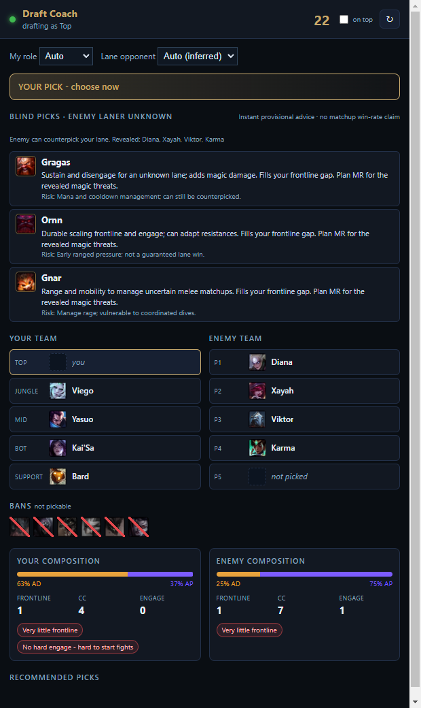
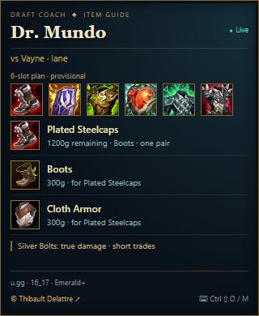

# LoL Draft Coach

<p align="center">
  
</p>

<p align="center">
  A real-time League of Legends draft and itemization assistant for Windows.
</p>

<p align="center">
  <a href="LICENSE"></a>
  
  
  
</p>

LoL Draft Coach follows champion select in real time, evaluates both compositions, and recommends
legal picks for your role. Once your champion is locked, it switches to item advice for the lane and
the enemy team. During the match, a small click-through overlay reacts to observed inventories.

It combines local draft analysis, current Riot item data, Emerald+ matchup/build statistics, and an
optional written analysis generated through your installed Claude CLI. It never clicks, picks, bans,
or buys anything for you.

## Preview

| Draft coach | In-game item overlay |
|:--:|:--:|
| [](docs/screenshots/draft-coach.png) | [](docs/screenshots/item-overlay.png) |

### Worked example: blind Top, then a fed enemy mage

These screenshots are generated from **fictional inputs passed through the production engine**.
Recommendations, explanations and item plans are computed; the capture script does not invent
Claude output or recommendation scores.

1. **You are Top.** Your allies lock Viego, Yasuo, Kai'Sa and Bard. The enemy reveals
   Diana, Xayah, Viktor and Karma; their top laner is still unknown. Aatrox, Jax,
   Renekton, Camille, Malphite and Vayne are banned.
2. **The instant engine returns Gragas → Ornn → Gnar.** Gragas leads the curated blind-pick
   ranking with sustain, disengage, magic damage and frontline. Ornn offers frontline and engage;
   Gnar offers range and mobility. These are heuristic blind recommendations, not measured
   matchup win rates against an unknown champion and not a Claude response.
3. **You choose Ornn, the second recommendation.** The opponent finishes with Gnar Top.
   At 25 minutes, Viktor is level 17, 13 kills, 9 assists and 240 CS with three completed AP
   items; the enemy AD champions have little equipment. You already own Mercury's Treads.
4. **The computed next item is Force of Nature.** The planner keeps your boots, prioritizes MR
   against the weighted magic threat, and shows its remaining components and six provisional slots.
   The base build comes from actual u.gg Top/Emerald+ data; the situational change is a heuristic,
   not a claim that this exact six-item combination has a measured win rate.

Inspect the [complete inputs and computed outputs](docs/examples/worked-example.json) and
[recorded statistical builds](docs/examples/baselines.json), including their patch and sample sizes.
The offline suite replays these inputs and checks that the published picks and item plan reproduce.
Regenerate both screenshots and records with `node scripts/electron.js scripts/capture-readme.js`.

## Features

- Reads picks, hovers, bans, pick order, assigned role, and timer from the local League client.
- Preserves the client roster order and distinguishes a hover from a completed lock-in.
- Infers enemy roles across the whole composition and keeps flex picks marked as uncertain.
- Lets you manually correct your role or lane opponent when the draft is ambiguous.
- Shows instant blind-pick options when the opposing laner has not been revealed.
- Ranks measured counters using game win rate, sample size, and a Wilson confidence bound.
- Keeps every recommendation legal by filtering bans, locked champions, and allied hovers twice.
- Uses current Riot item definitions and filters removed or unavailable items.
- Considers build win rate only among alternatives from the same purchase slot.
- Shows the opening combination's win rate separately from champion and individual-item rates.
- Reacts to enemy crit, healing, damage mix, true damage, and your current inventory.
- Plans six final slots (five items + boots), with a separate starting purchase and remaining
  components/cost for the next item. Missing statistical slots are explicitly marked incomplete.
- Reweights threats from visible item investment, level, kills, assists and farm, with extra
  lane weight early. AP purchases can override an AD champion's usual profile.
- Prioritizes tank resistances against weighted threats; preserves carry opening damage items.
  Carry penetration/MR deviations require supported champion build alternatives. Vayne does
  not automatically buy armor penetration into armor: Silver Bolts already bypass armor.
- Enforces one boots recommendation and removes completed items or covered components.
- Continues with deterministic item rules when u.gg or the model is unavailable.

The live purchase plan updates on each successful game poll; model refinements run separately.
Threat weights and damage mix are heuristics, not measured DPS or a proven optimal build.
Enemy exact gold is unavailable: item investment and scoreboard stats are visible power proxies.
The planner keeps completed equipment and does not automatically recommend selling it.
Starting items and components are purchases along the way, not additional final equipment slots.

## Quick start

### Requirements

- Windows 10 or 11
- Node.js 20 or newer
- The League of Legends client
- The [Claude Code CLI](https://docs.anthropic.com/en/docs/claude-code/overview), installed and signed in,
  for written recommendations

The instant counter list, composition analysis, and rule-based item overlay do not require Claude.

### Install and run

```powershell
git clone https://github.com/thibault-delattre/lol-drafter.git
cd lol-drafter
npm install
npm.cmd start
```

Open the coach before champion select, or launch it during a game. It detects the client automatically.
Use League in **Borderless** or **Windowed** mode so the overlay can remain visible.

### Overlay controls

- `Ctrl+Shift+O` — hide or show the item overlay.
- `Ctrl+Shift+M` — move it to the top-left corner of the monitor under your cursor.

The compact 320 × 390 overlay uses item portraits, short tactical cues, and a dark-and-gold
League-inspired design. Available build statistics retain their win rate and sample size.
It never takes keyboard focus; mouse clicks pass through to League except over the
**© Thibault Delattre** signature, which opens the author's GitHub profile.

## How recommendations are selected

### Draft

When the enemy laner is known, the lane is the first priority. The app retrieves the observed
Emerald+ result for each available champion into that opponent, removes samples below 300 games,
then ranks the survivors by the lower bound of a 95% Wilson interval. Composition fit breaks ties
between viable lane choices.

When the laner is unknown, the app avoids inventing a matchup. It shows a provisional blind-pick
shortlist based on a curated role pool, the revealed enemy champions, damage balance, frontline,
crowd control, and engage. Flex champions remain explicitly uncertain until the draft resolves.

These percentages describe whole-game outcomes, not lane win rates or gold at 15 minutes. They are
useful evidence, but do not prove that one champion wins the lane in every context.

### Builds

The statistical baseline comes from worldwide Emerald+ ranked solo/duo games. The current patch is
requested first; a previous-patch fallback is visibly labeled. Build alternatives are compared only
within the same purchase stage, using both win rate and sample size. If every option is thin, the app
uses a clearly marked popularity fallback.

The baseline is then adapted to the actual game:

- Offensive power spikes remain the default when survival does not require a deviation. For example,
  Vayne keeps Berserker's Greaves against a mixed or magic-heavy team unless physical attacks are the
  concrete reason she cannot deal damage.
- Randuin's Omen appears for suitable tanks after meaningful crit purchases are observed.
- Anti-heal accounts for how it is applied. Bramble Vest requires the enemy to attack its owner, so
  it is not treated as a reliable answer to Vladimir's spell healing.
- Vayne's Silver Bolts are treated as max-health true damage; armor is never described as reducing it.
- Only one completed pair of boots is recommended, including after model output is validated.

Item win rates are observational and contain purchase-timing and survivor bias. A high late-item win
rate is never compared directly with a first-item rate.

## Data and privacy

| Source | Purpose |
|---|---|
| Riot League Client API | Local champion-select state |
| Riot Live Client Data API | Local in-game teams, roles, and visible inventories |
| Riot Data Dragon | Champion identities, icons, and current item definitions |
| u.gg statistical files | Role-specific matchup and build aggregates |
| Claude CLI | Optional natural-language draft and build reasoning |

League credentials, lockfile tokens, and player data stay on the local machine. The application does
not include a Riot API key or an Anthropic API key. u.gg's endpoints and the champion-select API are
undocumented, so they can change without notice. See [the data review](docs/DATA_RESEARCH.md) for the
source assumptions and verified payload structure.

## Development

### Interactive scenario laboratory — no League client needed

```powershell
npm.cmd run simulate
```

The HTML laboratory first asks for **your role** (Top, Jungle, Mid, Bot or Support).
Choosing it starts an empty **animated ranked draft**:
A separate 15-second ban phase comes first; bans are then revealed in five pairs before any pick.
Both teams receive independently shuffled player orders on restart. The displayed roster follows
that order from top to bottom, so any role (including Support) can pick first. Swaps move the rows
while preserving completed picks. Picks follow **Blue 1 → Red 2 → Blue 2 → Red 2 → Blue 2 → Red 1**.
Each pick locks after **15 seconds**, with a visible countdown; an accelerated test speed is optional.
Use **Échanger mon tour avec** to swap your pick order with an unlocked teammate. Your role stays
the same, completed picks cannot move, and swapping does not reset the clock.
Every pick has a hover and a separate lock-in; the production coach recalculates after each event,
and item advice starts only after your lock. Choose blue/red side, playback speed, pause,
step forward or restart. These are generated simulated players, not a connection to a real match.

There is no scenario picker. Each new draft samples champions from measured **u.gg champion-role
game counts**, normalized within the role, World/Emerald+ and the same patch. High-pick-frequency
champions appear more often; sampling is not based on win rate. Observations below 0.1% of role
selections or 300 games are excluded to avoid extremely rare off-role picks. Remaining weights
are renormalized after bans and prior picks. All ten picks are distinct and unbanned.
Bans are random from the eligible champion population; they do not reproduce measured ban rates.
The published pick frequency is a share of role selections, not u.gg's overall game pick-rate denominator.

The simulator refreshes these distributions on startup (12-hour cache) and falls back to the bundled
snapshot when unavailable. The source patch and collection date are visible. Refresh the bundled
snapshot with `node scripts/electron.js scripts/refresh-popularity.js`. Predefined cases remain
only in automated tests. Advanced JSON import/export remains available for reproducing bugs.

Offline mode uses the recorded Gragas, Ornn, Mundo and Vayne build snapshots and clearly marks
unavailable matchup statistics. **Statistiques u.gg en ligne** is enabled by default to use the real statistics
provider (which can serve its cache). Champion portraits require access to Riot's image CDN.
The laboratory executes the production parsers, role inference, blind picks, matchup ranking and
item planner; it does not connect to LCU or fabricate a model response. Claude scheduling is covered
separately by orchestration tests and the real model smoke test.

Add assertions to your JSON, for example:

```json
"expect": { "topPick": "Gragas", "opponent": null }
```

For live builds, use `target`, `slots` and `planContains` (English item names). Each assertion shows
its expected value, actual value and pass/fail status. The automated suite also checks 200 reproducible
draft variations for illegal recommendations. These tests catch regressions; they cannot prove
that every future patch, matchup or optimal tactical decision is covered.

```powershell
npm.cmd test             # deterministic offline and orchestration checks
npm.cmd run test:simulate # presets, custom assertions and 200 draft variations
npm.cmd run test:sim-ui   # HTML laboratory rendering and custom input checks
npm.cmd run test:stats   # current u.gg feed and orientation checks
npm.cmd run test:ui      # hidden Electron render and lifecycle checks
npm.cmd run test:build   # real Claude response smoke test
```

Preview without a running League client:

```powershell
$env:COACH_MOCK = '1'       # draft view
npm.cmd start

$env:COACH_MOCK = 'build'   # locked champion and build view
npm.cmd start
```

The runtime has one npm dependency: Electron. Application code uses CommonJS and has no build step.

### Project structure

| Path | Responsibility |
|---|---|
| `src/main/draft.js` | Normalizes champion select and enforces availability |
| `src/main/lanes.js` | Enemy role assignment and flex-pick handling |
| `src/main/ugg.js` | Matchup/build retrieval, caching, and statistical ranking |
| `src/main/analyze.js` | Local composition analysis |
| `src/main/items.js` | Immediate inventory-aware item options |
| `src/main/build-plan.js` | Six-slot purchase plan, recipes and estimated live threat weights |
| `src/main/live.js` | Riot Live Client Data normalization |
| `src/main/prompt.js` | Pure draft and build prompt construction |
| `src/main/main.js` | Polling, scheduling, IPC, and window lifecycle |
| `src/renderer/` | Main UI and click-through overlay |

More detail is available in [ARCHITECTURE.md](docs/ARCHITECTURE.md).

## Known limitations

- Enemy roles are inferred during ranked champion select. Flex picks can remain ambiguous until the
  final enemy champion appears; use the opponent selector if a lane swap is known.
- Exclusive fullscreen can cover desktop overlays. Borderless mode is recommended.
- Statistical feeds may lag immediately after a patch and can become unavailable.
- Written model recommendations can still be wrong; deterministic legality and item checks provide
  guardrails rather than a guarantee of an optimal pick or build.
- New champions initially use derived attributes until their curated entries are added.

## License

Released under the [MIT License](LICENSE).

LoL Draft Coach is not endorsed by Riot Games and does not reflect the views or opinions of Riot
Games or anyone officially involved in producing or managing Riot Games properties. Riot Games and
all associated properties are trademarks or registered trademarks of Riot Games, Inc.
